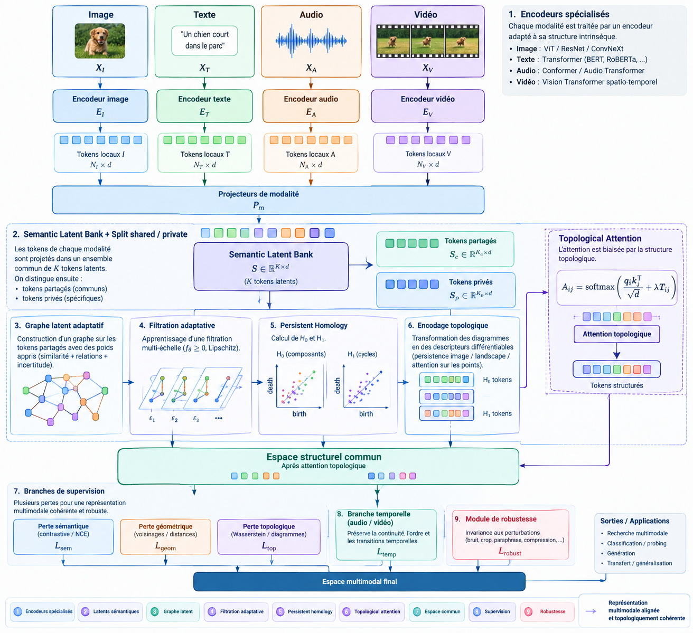

# TopoFusion-TR Hyper

## Apprentissage de représentation multimodale guidé par la géométrie et la topologie



> **Question scientifique.** Comment apprendre un espace latent dans lequel deux modalités différentes représentent la même information sémantique, tout en préservant leur structure intrinsèque et en étant robuste au bruit et aux transformations ?

## 1. Objectif

Cette version constitue une implémentation de recherche de TopoFusion-TR autour de cinq idées :

1. encodeurs spécialisés par modalité ;
2. banque de latents sémantiques avec séparation partagé/privé ;
3. graphe latent adaptatif et filtration apprise ;
4. attention relationnelle biaisée par la structure topologique ;
5. supervision conjointe sémantique, géométrique, topologique et robuste.

Le dataset principal demandé est `AhmedSSabir/Textual-Image-Caption-Dataset`, chargé avec `datasets.load_dataset`.

## 2. Point méthodologique essentiel

Le dataset fourni est **bimodal image + texte**. L'architecture prévoit néanmoins des interfaces audio et vidéo afin que le modèle puisse être étendu sans modifier le cœur du mécanisme. Le pipeline actuel n'invente donc pas de faux audio/vidéo.

La persistent homology exacte est utilisée comme **diagnostic scientifique post-entraînement**. L'optimisation utilise une signature topologique différentiable fondée sur des graphes multi-échelles et leurs opérateurs spectraux. Cette séparation évite de confondre un calcul PH exact non nécessairement différentiable avec une fonction de perte entraînable.

## 3. Arborescence

```text
TopoFusion_TR_Hyper/
├── README.md                         # Documentation scientifique et protocole expérimental.
├── requirements.txt                  # Dépendances Python reproductibles.
├── pyproject.toml                    # Métadonnées et configuration du paquet.
├── configs/
│   └── default.yaml                  # Hyperparamètres de l'expérience.
├── docs/
│   └── architecture.png             # Architecture fournie par le chercheur.
├── topofusion/
│   ├── __init__.py                   # API publique du paquet.
│   ├── configuration.py              # Configuration typée de l'expérience.
│   ├── donnees.py                    # Dataset HF, splits et collations multimodales.
│   ├── encodeurs.py                  # Encodeurs image/texte et interfaces audio/vidéo.
│   ├── latents.py                    # Banque de latents partagés et privés.
│   ├── graphe.py                     # Graphe latent adaptatif.
│   ├── topologie.py                  # Filtration, signature topologique différentiable.
│   ├── attention.py                  # Attention relationnelle/topologique.
│   ├── pertes.py                     # Pertes sémantique/géométrique/topologique/robuste.
│   ├── modele.py                     # Modèle TopoFusion-TR complet.
│   ├── metriques.py                  # Retrieval, géométrie, voisinage et robustesse.
│   ├── topologie_exacte.py            # Persistent homology GUDHI post-hoc.
│   ├── visualisations.py              # Figures dataset, latent, apprentissage et topologie.
│   ├── experiment.py                  # Boucle train/validation/test reproductible.
│   └── baselines.py                   # B0, B1, B2 et variantes d'ablation.
├── scripts/
│   ├── visualiser_dataset.py          # Inspection initiale des exemples.
│   ├── entrainer.py                   # Entraînement principal.
│   ├── evaluer.py                     # Évaluation finale sur le test.
│   └── rapport.py                     # Construction d'un rapport HTML compact.
└── tests/
    ├── test_donnees.py                # Tests du pipeline de données.
    ├── test_topologie.py              # Tests de la filtration et de la signature.
    ├── test_modele.py                 # Tests forward/backward.
    └── test_metriques.py              # Tests des métriques.
```

## 4. Installation

```bash
python -m venv .venv
# Windows PowerShell
.\.venv\Scripts\Activate.ps1
# Linux/macOS
source .venv/bin/activate
pip install -r requirements.txt
```

## 5. Vérification immédiate sans télécharger le dataset

```bash
python -m pytest -q
```

## 6. Visualiser le dataset réel au début

```bash
python scripts/visualiser_dataset.py --max-samples 32
```

La figure est écrite dans `outputs/dataset/exemples_bruts.png` et les informations du split dans `outputs/dataset/repartition.json`.

## 7. Entraînement

Petit protocole de développement :

```bash
python scripts/entrainer.py --max-samples 512 --epochs 5
```

Protocole plus sérieux :

```bash
python scripts/entrainer.py --max-samples 5000 --epochs 30
```

L'entraînement crée automatiquement :

- `outputs/latent/avant_apres.png` ;
- `outputs/training/courbes_pertes.png` ;
- `outputs/training/courbes_validation.png` ;
- `outputs/validation/metriques_validation.json` ;
- `outputs/test/metriques_test.json` ;
- `outputs/test/metriques_test.png` ;
- `outputs/topology/diagrammes_persistance.png` si GUDHI est installé ;
- `outputs/rapport_final/resultats.json`.

## 8. Protocole expérimental

```text
                  DATASET HF
                      │
             ┌────────┼────────┐
             ↓        ↓        ↓
           TRAIN      VAL      TEST
             │         │        │
             │         └── sélection du checkpoint
             ↓
      TopoFusion-TR / baseline
             │
             ↓
     représentation commune
             │
       ┌─────┼──────┐
       ↓     ↓      ↓
    sémantique géométrie topologie
       │     │      │
       └─────┼──────┘
             ↓
          robustesse
             │
             ↓
     évaluation finale TEST
             │
       ┌─────┼──────────────┐
       ↓     ↓              ↓
 retrieval geometry     topology exact
```

Le test n'est pas utilisé à chaque époque : il reste réservé à l'évaluation finale afin de limiter le risque de fuite expérimentale.

## 9. Baselines

- **B0** : encodeurs + projection + moyenne + classifieur/retrieval sans contrainte d'alignement ;
- **B1** : B0 + alignement contrastif global ;
- **B2** : B1 + alignement géométrique des matrices de distances ;
- **B3** : B2 + topologie différentiable multi-échelle ;
- **TopoFusion-TR** : B3 + banque shared/private + filtration adaptative + attention topologique + robustesse.

Les baselines B0-B3 disposent d'un constructeur et d'un script d'entraînement séparé (`scripts/entrainer_baseline.py`). B0 est volontairement dépourvue d'alignement, B1 utilise l'objectif contrastif, B2 ajoute la géométrie et B3 ajoute le proxy topologique multi-échelle. L'objectif scientifique est de mesurer séparément l'apport de chaque mécanisme, et non de déclarer une nouveauté sur la seule base du diagramme architectural.

## 10. Métriques

### Sémantique / retrieval

- Recall@1, Recall@5, Recall@10 image→texte ;
- Recall@1, Recall@5, Recall@10 texte→image ;
- mAP image→texte ;
- mAP texte→image.

### Géométrie / structure

- erreur relative des matrices de distances ;
- préservation des voisinages @5 et @10 ;
- trustworthiness.

### Robustesse

- similarité cosinus clean/corrompu ;
- Recall@1 clean/corrompu ;
- dégradation relative du Recall@1.

### Topologie

- nombre de classes finies H0/H1 ;
- persistance totale H0/H1 ;
- persistance maximale H0/H1 ;
- distance de Wasserstein H0/H1 ;
- distance de bottleneck H0/H1 ;
- diagrammes de persistance.

## 11. Limites honnêtes

La démonstration initiale utilise uniquement les deux modalités effectivement présentes dans le dataset fourni. Pour une publication, les conclusions sur l'extension audio/vidéo devront être établies sur un véritable dataset multimodal contenant ces modalités. De même, une amélioration des métriques ne constitue pas à elle seule une preuve de nouveauté : il faudra comparer plusieurs baselines, plusieurs seeds, des corruptions contrôlées et idéalement plusieurs datasets.

## 12. Lancer les ablations

```bash
python scripts/entrainer_baseline.py --baseline B0 --max-samples 512 --epochs 5
python scripts/entrainer_baseline.py --baseline B1 --max-samples 512 --epochs 5
python scripts/entrainer_baseline.py --baseline B2 --max-samples 512 --epochs 5
python scripts/entrainer_baseline.py --baseline B3 --max-samples 512 --epochs 5
```

B0-B3 sont volontairement séparées du protocole principal afin de ne pas mélanger sélection de checkpoint et comparaison des contributions.
